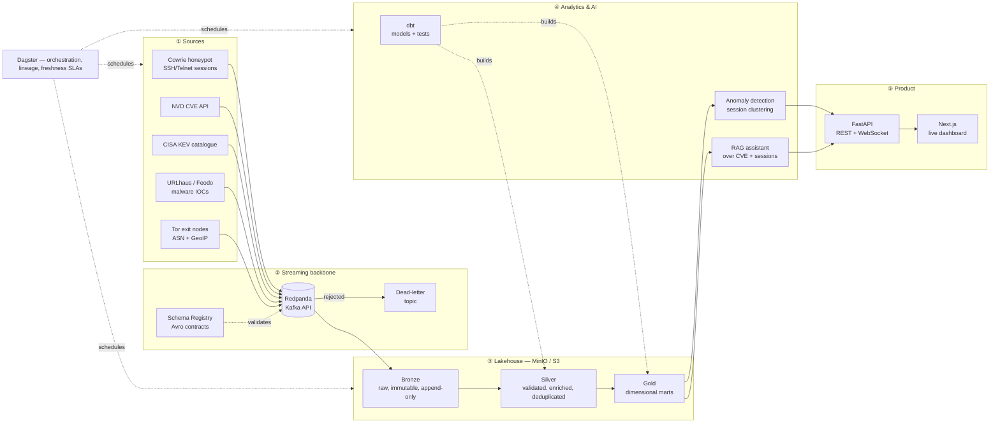

<div align="center">

# AEGIS

**A JVM-free threat-intelligence lakehouse.**

Live attack telemetry and public threat feeds, streamed through Kafka into an
Apache Iceberg lakehouse, modelled with dbt, analysed with ML, and served to a
real-time dashboard — running end to end on a 7 GB laptop.

[](#)
[](#)
[](#)
[](#)
[](#)

</div>

---

## The problem

Security teams drown in telemetry. A single exposed SSH port receives thousands
of login attempts a day; public feeds publish tens of thousands of new
indicators of compromise a week; the CVE database grows by roughly a thousand
entries a month. Almost none of it is correlated. The question a defender
actually asks — *"is anything attacking me right now that matches a known
campaign, and does it target software I actually run?"* — requires joining
data that lives in five incompatible places.

**AEGIS is a data platform that answers that question.** It ingests live attack
sessions and public threat intelligence, lands them in a governed lakehouse,
models them into analytics-ready marts, scores them with anomaly detection, and
exposes both a real-time dashboard and a retrieval-augmented assistant that can
reason over the corpus.

## Why it is built this way

This project deliberately rejects the default "big data" stack. There is no
Spark, no JVM, no cluster. Every component is a single-node, embedded engine:

| Concern | Conventional choice | AEGIS choice | Reason |
|---|---|---|---|
| Streaming broker | Apache Kafka + ZooKeeper | **Redpanda** | Same Kafka API, one binary, ~220 MB resident instead of ~2 GB |
| Table format | Delta Lake on Spark | **Apache Iceberg via `pyiceberg`** | ACID, time travel and schema evolution with **no JVM at all** |
| Compute engine | Spark / EMR | **DuckDB + Polars + PyArrow** | Vectorised, single-node, and faster than Spark below ~100 GB |
| Orchestration | Airflow | **Dagster** | Asset-based lineage; declarative freshness; far lighter |
| Transformations | Spark SQL | **dbt-duckdb** | Version-controlled, tested, documented SQL |

This is not a compromise made for a small laptop — it is where a large part of
the data industry moved in 2025–2026, once people measured how much of their
Spark spend was processing datasets that fit in RAM. The architecture is
deliberately *portable*: because every storage interaction speaks the S3 API and
every table is Iceberg, moving to AWS S3 + Athena/EMR in Phase 9 changes
configuration, not code.

> **The interview answer this project gives you:** *"I chose single-node compute
> because I measured the data volume first. When it outgrows one machine, the
> Iceberg tables are already readable by Spark, Trino and Athena without a
> migration — the table format is the interface, not the engine."*

## Architecture



### The medallion layers, concretely

| Layer | Contains | Guarantee | Example |
|---|---|---|---|
| **Bronze** | Exactly what the source sent, plus ingestion metadata | Immutable, append-only, replayable | A raw Cowrie JSON line with `_ingested_at`, `_kafka_offset` |
| **Silver** | Parsed, type-safe, validated, enriched, deduplicated | One row = one real-world event, conformed | A login attempt with resolved ASN, country, and IOC match flag |
| **Gold** | Business-shaped aggregates and dimensions | Answers a question directly | `fct_attack_session`, `dim_attacker`, `agg_daily_threat_score` |

Bronze is never edited. If a parsing bug is found in Silver, the fix is to
change the transformation and **replay from Bronze** — which is precisely why
Bronze exists and why Iceberg's time travel matters.

## Quick start

**Prerequisites:** Docker Desktop, Python 3.10+, ~4 GB free RAM, ~10 GB disk.

```powershell
git clone <your-repo-url> aegis
cd aegis

.\aegis.ps1 setup      # create the venv and install dependencies
.\aegis.ps1 up         # start Redpanda, MinIO, Postgres, Console
.\aegis.ps1 doctor     # verify every layer is reachable
```

Then open:

| Service | URL | What it shows |
|---|---|---|
| Redpanda Console | http://localhost:8080 | Topics, live messages, consumer lag, schemas |
| MinIO Console | http://localhost:9001 | The lakehouse files as they are written |

All task-runner commands: `.\aegis.ps1 help`

### Collect real threat data

```powershell
aegis sources                              # what can be collected
aegis collect cisa_kev --limit 3 --show    # see the event shape, store nothing
aegis collect all                          # every feed -> compressed files
python scripts/explore.py                  # ask SQL questions of what you collected
```

A full collection takes about six seconds and produces roughly 18,000 events:

| Source | Events | Downloaded | What it tells you |
|---|---:|---:|---|
| `urlhaus` | ~15,000 | 2.8 MB | Web addresses serving malware right now |
| `cisa_kev` | ~1,700 | 1.7 MB | Vulnerabilities attackers are *proven* to be exploiting |
| `tor_exit` | ~1,300 | 19 KB | Every current Tor exit node |
| `feodo` | ~5 | 2 KB | Live botnet command-and-control servers |

Some findings the collected data already supports (see `scripts/explore.py`):

- Microsoft accounts for **386** actively-exploited vulnerabilities, **115** of
  them tied to ransomware campaigns — more than the next four vendors combined.
- The `mirai` and `Mozi` IoT botnets account for roughly **10,000** of the
  malicious URLs observed in the last 30 days.
- Cross-referencing botnet control servers against Tor exit nodes shows the
  operators are **not** hiding behind Tor — they use commercial cloud hosting
  (AWS, DigitalOcean) instead.

That last one is a question no single feed can answer. It only became askable
once two sources shared one queryable place — which is the entire argument for
building a lakehouse.

## Project layout

```
aegis/
├── aegis.ps1                 # task runner (Windows); Makefile mirrors it for CI
├── pyproject.toml            # dependencies, grouped by the phase that adds them
├── infra/
│   ├── docker-compose.yml    # infrastructure only — app code runs on the host
│   └── docker/postgres-init/ # schemas + ops tables, created on first boot
├── src/aegis/
│   ├── config.py             # typed 12-factor settings, validated once
│   ├── logging.py            # structured JSON logging
│   ├── sources/              # ② feed collectors + honeypot reader
│   ├── streaming/            # ② producers, consumers, schemas, DLQ
│   ├── lakehouse/            # ③ Iceberg table definitions and writers
│   ├── ml/                   # ④ features, anomaly detection, RAG
│   └── api/                  # ⑤ FastAPI serving layer
├── dbt/                      # ④ silver + gold models, tests, docs
├── scripts/doctor.py         # environment diagnostics
├── tests/
└── docs/
    ├── ARCHITECTURE.md
    └── adr/                  # architecture decision records
```

## Build roadmap

| Phase | Theme | Status |
|---|---|---|
| **0** | Foundations: infra, config, logging, quality gates | 🟢 **Done** |
| **1** | Sources: 4 live threat feeds, envelope, sinks, watermarks | 🟢 **Done** |
| 2 | Streaming: Kafka producers, schemas, partitioning, DLQ | ⚪ Next |
| 3 | Lakehouse: Iceberg bronze, time travel, compaction | ⚪ |
| 4 | Modelling: dbt silver/gold, data quality, contracts | ⚪ |
| 5 | Orchestration: Dagster assets, backfills, freshness SLAs | ⚪ |
| 6 | AI: anomaly detection, clustering, MLflow, RAG assistant | ⚪ |
| 7 | Product: FastAPI + Next.js real-time dashboard | ⚪ |
| 8 | Security & governance: PII redaction, RBAC, SAST, audit | ⚪ |
| 9 | Cloud: Terraform, GitHub Actions, observability, FinOps | ⚪ |

## Architecture decisions

Significant choices are recorded as ADRs in [`docs/adr/`](docs/adr/) — what was
decided, what the alternatives were, and what it costs.

## Ethics and legal note

The honeypot component only ever records connections made **to infrastructure
operated by this project**. It is a passive sensor: it never scans, probes or
attacks any third party. Attacker IP addresses are treated as personal data
under the GDPR and are pseudonymised in the Silver layer (see Phase 8). All
threat feeds consumed are published for public use under their respective
licences.

## Licence

MIT — see [LICENSE](LICENSE).

---

<div align="center">
Built by <a href="https://nourelhouda-farhat.netlify.app/">Nourelhouda Farhat</a>
</div>
