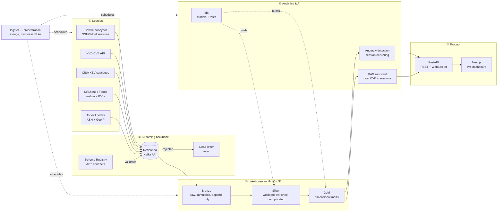

<div align="center">

# AEGIS

**A JVM-free threat-intelligence lakehouse.**

Live attack telemetry and public threat feeds, streamed through Kafka into an
Apache Iceberg lakehouse, modelled with dbt, analysed with ML, and served to a
real-time dashboard — running end to end on a 7 GB laptop.

[](#)
[](#)
[](#)
[](#)
[](#)

</div>

---

## The problem

Security teams drown in telemetry. A single exposed SSH port receives thousands
of login attempts a day; public feeds publish tens of thousands of new
indicators of compromise a week; the CVE database grows by roughly a thousand
entries a month. Almost none of it is correlated. The question a defender
actually asks — *"is anything attacking me right now that matches a known
campaign, and does it target software I actually run?"* — requires joining
data that lives in five incompatible places.

**AEGIS is a data platform that answers that question.** It ingests live attack
sessions and public threat intelligence, lands them in a governed lakehouse,
models them into analytics-ready marts, scores them with anomaly detection, and
exposes both a real-time dashboard and a retrieval-augmented assistant that can
reason over the corpus.

## Why it is built this way

This project deliberately rejects the default "big data" stack. There is no
Spark, no JVM, no cluster. Every component is a single-node, embedded engine:

| Concern | Conventional choice | AEGIS choice | Reason |
|---|---|---|---|
| Streaming broker | Apache Kafka + ZooKeeper | **Redpanda** | Same Kafka API, one binary, ~220 MB resident instead of ~2 GB |
| Table format | Delta Lake on Spark | **Apache Iceberg via `pyiceberg`** | ACID, time travel and schema evolution with **no JVM at all** |
| Compute engine | Spark / EMR | **DuckDB + Polars + PyArrow** | Vectorised, single-node, and faster than Spark below ~100 GB |
| Orchestration | Airflow | **Dagster** | Asset-based lineage; declarative freshness; far lighter |
| Transformations | Spark SQL | **dbt-duckdb** | Version-controlled, tested, documented SQL |

This is not a compromise made for a small laptop — it is where a large part of
the data industry moved in 2025–2026, once people measured how much of their
Spark spend was processing datasets that fit in RAM. The architecture is
deliberately *portable*: because every storage interaction speaks the S3 API and
every table is Iceberg, moving to AWS S3 + Athena/EMR in Phase 9 changes
configuration, not code.

> **The interview answer this project gives you:** *"I chose single-node compute
> because I measured the data volume first. When it outgrows one machine, the
> Iceberg tables are already readable by Spark, Trino and Athena without a
> migration — the table format is the interface, not the engine."*

## Architecture



### The medallion layers, concretely

| Layer | Contains | Guarantee | Example |
|---|---|---|---|
| **Bronze** | Exactly what the source sent, plus ingestion metadata | Immutable, append-only, replayable | A raw Cowrie JSON line with `_ingested_at`, `_kafka_offset` |
| **Silver** | Parsed, type-safe, validated, enriched, deduplicated | One row = one real-world event, conformed | A login attempt with resolved ASN, country, and IOC match flag |
| **Gold** | Business-shaped aggregates and dimensions | Answers a question directly | `fct_attack_session`, `dim_attacker`, `agg_daily_threat_score` |

Bronze is never edited. If a parsing bug is found in Silver, the fix is to
change the transformation and **replay from Bronze** — which is precisely why
Bronze exists and why Iceberg's time travel matters.

## Quick start

**Prerequisites:** Docker Desktop, Python 3.10+, ~4 GB free RAM, ~10 GB disk.

```powershell
git clone <your-repo-url> aegis
cd aegis

.\aegis.ps1 setup      # create the venv and install dependencies
.\aegis.ps1 up         # start Redpanda, MinIO, Postgres, Console
.\aegis.ps1 doctor     # verify every layer is reachable
```

Then open:

| Service | URL | What it shows |
|---|---|---|
| Redpanda Console |  http://localhost:8088 | Topics, live messages, consumer lag, schemas |
| Schema Registry | http://localhost:18081/subjects | The registered data contracts |
| MinIO Console | http://localhost:9001 | The lakehouse files as they are written |

All task-runner commands: `.\aegis.ps1 help`

### Collect real threat data

```powershell
aegis sources                              # what can be collected
aegis collect cisa_kev --limit 3 --show    # see the event shape, store nothing
aegis collect all                          # every feed -> compressed files
python scripts/explore.py                  # ask SQL questions of what you collected
```

A full collection takes about six seconds and produces roughly 18,000 events:

| Source | Events | Downloaded | What it tells you |
|---|---:|---:|---|
| `urlhaus` | ~15,000 | 2.8 MB | Web addresses serving malware right now |
| `cisa_kev` | ~1,700 | 1.7 MB | Vulnerabilities attackers are *proven* to be exploiting |
| `tor_exit` | ~1,300 | 19 KB | Every current Tor exit node |
| `feodo` | ~5 | 2 KB | Live botnet command-and-control servers |

Some findings the collected data already supports (see `scripts/explore.py`):

- Microsoft accounts for **386** actively-exploited vulnerabilities, **115** of
  them tied to ransomware campaigns — more than the next four vendors combined.
- The `mirai` and `Mozi` IoT botnets account for roughly **10,000** of the
  malicious URLs observed in the last 30 days.
- Cross-referencing botnet control servers against Tor exit nodes shows the
  operators are **not** hiding behind Tor — they use commercial cloud hosting
  (AWS, DigitalOcean) instead.

That last one is a question no single feed can answer. It only became askable
once two sources shared one queryable place — which is the entire argument for
building a lakehouse.

### Stream it instead

The same collectors publish to Kafka without a single line of collector code
changing — the destination is a `Sink`, and Kafka is just another implementation:

```powershell
aegis topics create                        # declare topics + set FULL compatibility
aegis collect all --to kafka               # ~18,000 events, Avro-encoded
aegis topics list                          # partitions, retention, message counts
aegis tail aegis.raw.feodo --limit 3       # read messages back
aegis lag --group aegis-bronze-writer      # how far behind a consumer is
python scripts/demo_contracts.py           # prove the schema contract + DLQ work
```

Messages are Avro-encoded against a schema in the Schema Registry, keyed by the
**entity** the event describes (the URL, the IP, the CVE) rather than by source.
That choice is what produces this:

| Partition | Messages |
|---|---:|
| 0 | 4,922 |
| 1 | 5,099 |
| 2 | 5,056 |

Keying by source instead would have put all 15,077 records on one partition and
left the other two empty — parallelism that exists on paper only.

`scripts/demo_contracts.py` proves, against the running system, that a breaking
schema change is refused, a safe one is accepted, and a record that cannot be
serialised lands in the dead-letter topic with its cause attached while the
pipeline keeps running.

### Land it in the lakehouse

```powershell
aegis lake init                     # create namespaces and Bronze tables
aegis lake sync all                 # Kafka -> Iceberg, resuming where it stopped
aegis lake tables                   # rows, files, snapshots, size
aegis lake history urlhaus          # every version the table has ever had
aegis lake sample feodo --snapshot <ID>   # read the table AS IT WAS
aegis lake sql "SELECT count(*) FROM cisa_kev"
```

Bronze holds ~21,800 rows across five Apache Iceberg tables in object storage,
written **without a JVM** - `pyiceberg` plus PyArrow, nothing else. What that
buys over a folder of Parquet files:

| Property | What it means here |
|---|---|
| **Atomic commits** | A query running during a write sees the previous snapshot, never a half-written table |
| **Time travel** | `urlhaus` has 7 snapshots; each is queryable, so "what did this look like before the bad load?" has an answer |
| **Hidden partitioning** | Files are laid out by ingestion day; a filtered query skips whole folders without the query naming the partition column |
| **Schema evolution** | Columns are tracked by ID, not name, so a rename is metadata-only |

Two ordering rules make the writer safe, and both are enforced structurally
rather than by convention:

1. **Flush to Iceberg, then commit Kafka offsets.** The flush happens inside the
   consumer's `before_commit` hook, so the unsafe order cannot be written.
2. **Never start a Bronze consumer at `latest`.** A fresh consumer group with
   `latest` silently skips everything already in the topic and reports success.

Both rules exist because this project broke them first - see
`docs/adr/0005-kafka-timestamps-are-ingestion-time.md`, which cost 45,233
records.

### Model it: Silver and Gold

```powershell
aegis model build                          # every model + every data test, in order
aegis model show gold.vendor_exploitation  # read a Gold table
aegis model sql "SELECT * FROM gold.c2_infrastructure"
aegis model docs                           # dbt docs site with the lineage graph
```

dbt reads Bronze straight from the Iceberg catalog and builds three layers in a
DuckDB warehouse — **12 models and 49 checks in about 6 seconds**:

| Silver table | Bronze rows | Silver rows | What collapsed |
|---|---:|---:|---|
| `kev_vulnerabilities` | 5,085 | **1,695** | three collections of the same catalogue |
| `tor_exit_nodes` | 4,017 | **1,339** | three snapshots of the same list |
| `feodo_c2_servers` | 29 | **5** | repeats, plus test records that leaked in |
| `urlhaus_urls` | 12,710 | 12,710 | one collection since the retention fix |

The naive Bronze count said Microsoft had 1,158 exploited vulnerabilities.
Silver says **386** — and a reconciliation test proves Silver holds exactly one
row for every distinct CVE in Bronze, so the number is not just unique but
complete.

What the Gold layer shows:

- **Botnet C2 servers are not hiding behind Tor.** None of the 5 is a Tor exit;
  4 of 5 are rented from DigitalOcean or Amazon. That is the first answer in
  AEGIS that required joining two sources.
- **URL counts mislead without host counts.** Mozi has 5,088 URLs across
  3,003 hosts (1.7 per host) — too distributed to block by address. `ua-wget`
  concentrates 2,940 URLs on just 328 hosts (9.0 per host).
- **Ransomware exposure is uneven.** 29.8% of Microsoft's exploited CVEs are
  ransomware-linked; Apple's and Google's are 0%.

The first build found three problems worth reading about in
`docs/adr/0006-silver-gold-with-dbt-in-a-duckdb-warehouse.md`: a concurrency
race in dbt's source loading, test records that had leaked into production
tables, and a uniqueness test that asserted the wrong invariant.

### Orchestrate it: Dagster

```powershell
aegis orchestrate run                       # the whole pipeline once, no UI
aegis orchestrate run --job rebuild_models  # only dbt: no downloads
aegis orchestrate dev                       # Dagster UI + daemon on http://localhost:3030
```

The pipeline is one Dagster **asset graph** of 19 assets, from each feed to each
Gold table. Each node is a thing that exists rather than a step that runs, so
Dagster derives the order itself, can say what is stale, and can rebuild one
table without re-running the chain:

```
raw/feodo -> bronze/feodo -> staging/stg_feodo -> silver/feodo_c2_servers -> gold/c2_infrastructure
```

| Guarantee | How |
|---|---|
| Flaky feeds are retried | 3 retries with exponential backoff (30s, 60s, 120s) |
| An empty Bronze table cannot feed dbt | blocking `has_rows` check on every Bronze asset |
| Bronze read everything Kafka held | `consumer_caught_up` lag check on every Bronze asset |
| Nothing goes stale silently | freshness policy on Bronze and Gold: warn at 8h, fail at 14h |
| Runs never overlap | queued run coordinator, one run at a time |
| Nothing downloads until you decide | 6-hour UTC schedule, **off by default** |

One end-to-end run, measured before and after:

| Feed | Bronze rows added | Silver rows added |
|---|---:|---:|
| `cisa_kev` | 1,709 | 14 |
| `urlhaus` | 12,681 | 391 |
| `tor_exit` | 1,325 | 34 |
| `feodo` | 7 | 0 |

19 assets materialised in about 90 seconds. 41 of 42 checks passed (the warning
is a known duplicate from a demo script), and dbt's three reconciliation tests
ran and passed. Bronze grew by a full collection; Silver grew only by genuinely
new entities, and every Silver table still equals the distinct keys in Bronze.

**Not yet exercised:** the schedule, the run sensors and freshness evaluation
all need the Dagster daemon (`aegis orchestrate dev`), which has not been run on
the development machine for lack of free memory. See
`docs/adr/0007-orchestration-as-a-dagster-asset-graph.md`, which also records
four traps the first build hit.

## Project layout

```
aegis/
├── aegis.ps1                 # task runner (Windows); Makefile mirrors it for CI
├── pyproject.toml            # dependencies, grouped by the phase that adds them
├── infra/
│   ├── docker-compose.yml    # infrastructure only — app code runs on the host
│   └── docker/postgres-init/ # schemas + ops tables, created on first boot
├── src/aegis/
│   ├── config.py             # typed 12-factor settings, validated once
│   ├── logging.py            # structured JSON logging
│   ├── sources/              # ② feed collectors + honeypot reader
│   ├── streaming/            # ② producers, consumers, schemas, DLQ
│   ├── lakehouse/            # ③ Iceberg table definitions and writers
│   ├── ml/                   # ④ features, anomaly detection, RAG
│   └── api/                  # ⑤ FastAPI serving layer
├── dbt/                      # ④ silver + gold models, tests, docs
├── scripts/doctor.py         # environment diagnostics
├── tests/
└── docs/
    ├── ARCHITECTURE.md
    └── adr/                  # architecture decision records
```

## Build roadmap

| Phase | Theme | Status |
|---|---|---|
| **0** | Foundations: infra, config, logging, quality gates | 🟢 **Done** |
| **1** | Sources: 4 live threat feeds, envelope, sinks, watermarks | 🟢 **Done** |
| **2** | Streaming: Kafka, Avro schemas, partitioning, DLQ | 🟢 **Done** |
| **3** | Lakehouse: Iceberg Bronze, time travel, partitioning | 🟢 **Done** |
| **4** | Modelling: dbt Silver/Gold, data tests, reconciliation | 🟢 **Done** |
| **5** | Orchestration: Dagster assets, checks, freshness, schedule | 🟢 **Done** |
| 6 | AI: anomaly detection, clustering, MLflow, RAG assistant | ⚪ Next |
| 7 | Product: FastAPI + Next.js real-time dashboard | ⚪ |
| 8 | Security & governance: PII redaction, RBAC, SAST, audit | ⚪ |
| 9 | Cloud: Terraform, GitHub Actions, observability, FinOps | ⚪ |

## Architecture decisions

Significant choices are recorded as ADRs in [`docs/adr/`](docs/adr/) — what was
decided, what the alternatives were, and what it costs.

## Ethics and legal note

The honeypot component only ever records connections made **to infrastructure
operated by this project**. It is a passive sensor: it never scans, probes or
attacks any third party. Attacker IP addresses are treated as personal data
under the GDPR and are pseudonymised in the Silver layer (see Phase 8). All
threat feeds consumed are published for public use under their respective
licences.

## Licence

MIT — see [LICENSE](LICENSE).

---

<div align="center">
Built by <a href="https://nourelhouda-farhat.netlify.app/">Nourelhouda Farhat</a>
</div>
